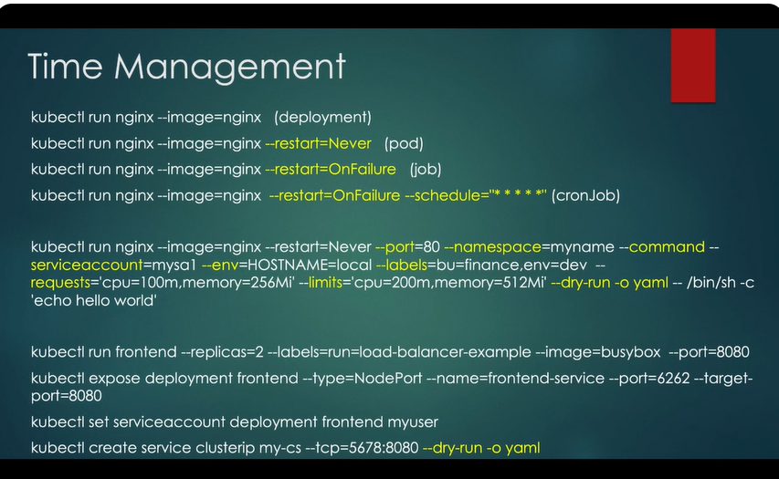
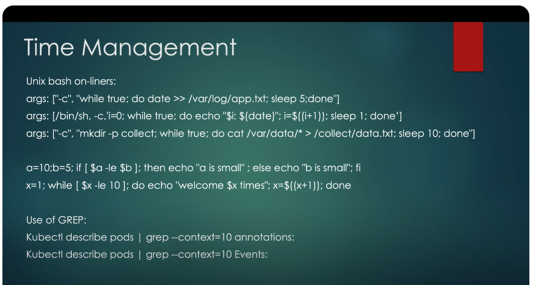

## Resources that doesn't have the create statement using help flag
- pv
- pvc

- use k expose pod pod_name --name svc_name --port port_num --dry-run=client -o yaml
- If role in ns --> rolebinding should also specified in ns
- pv is cluster wide BUT pvc -->is namespaced --> and only a pod in the same ns of the pvc can use it
service ports:
- volumeClaimTemplates in statefulsets
- Pod-Scoped Volumes:

Unlike regular volumes, the volumes created via volumeClaimTemplates are pod-specific and persist even if the pod is deleted and recreated.
Data Persistence:

Because StatefulSets guarantee that pods retain their identity (e.g., pod-0, pod-1), the PVCs ensure that the data associated with a specific pod is preserved across pod restarts or rescheduling.
Volume Scaling:

As you scale the StatefulSet replicas, Kubernetes dynamically creates new PVCs for new pods based on the same template.

Feature	    Regular Volumes	                    volumeClaimTemplates
Scope	    Shared among pods	                Unique to each pod in the StatefulSet
Creation	Pre-created manually	            Dynamically created by the StatefulSet
Use Case	Stateless applications	            Stateful applications
Persistence	Does not persist with pod identity	Persists with pod identity

hostPath vs emptyDir

- cancreate multiple items in same file like
```
apiVersion: v1
kind: List
items:
  - kind: PersistentVolume
    apiVersion: v1
    metadata:
      name: redis01
    spec:
      accessModes: ["ReadWriteOnce"]
      capacity:
        storage: 1Gi
      hostPath:
        path: /redis01
  - kind: PersistentVolume
    apiVersion: v1
    metadata:
      name: redis02
    spec:
      accessModes: ["ReadWriteOnce"]
      capacity:
        storage: 1Gi
      hostPath:
        path: /redis02
```
- Service : mainly selector(dict not array) and ports


netpol
storageclass
cm volume
pod command should start with /bin/sh -c
probes
job & cronjob
scheduling pod on specific nodes
ingress
use k replace --force -->
cronjob --> if task not completed within 20 seconds, job fail and pod terminated --> set activeDeadSeconds=20

## test reaching svc from a pod
k exec -it webapp-color -- sh
in shell run this -->  nc -v -z -w 2 secure-service 80 -->


- creating a pod --expose --> creates clusterip svc
- replicaset vs replicationcontroller(older)
- rs --> if changed the image need to delete the pods or rs to be affected
- in docker CMD vs Entrypoint --> we run cmd + entrypoint, override cmd directly and override entrypoint with --entrypoint flag
- in k8s --> command is for entrypoint (whole commnad override) ,args is for cmd(passing args to the docker command)
- securityContext at both pod level and container level,capabilities only supported at container level, container level overide pod level
- resources (requests and limits) , LimitRange, ResourceQuota
- taints & tolerations are meant for the node to not accept any pod  it doesn't want (based on taint_effect) but the tolerated pod can be placed to different node
- nodeSelector --> specify simple node label
- nodeName --> specify the nodeName directly
- If any of the init containers failed to complete the pod is restarted till all of them complete
- RollingUpdate is the default strategy, use --record flag when update deploy to record event (Change cause is added as annotation -> kubernetes.io/change-cause
- maxUnavailable --> how many pods can be down in updating deployment)
- maxSurge --> how many pods can we go above num of pods specified in replica
- Pod has restartPolicy set to `Always` by default
- NetPol : -
  - if I have multiple records in the `from` array --> it works as OR operation 
  - in the from array `element`(like first one) which has pod and ns selctor it works as AND operation , both should be met
- hostPath --> creates the directory directly on host
- emptyDir --> files will exist on host as long as the pod is running in the node, once pod deleted, files will get deleted too
- can't change the pvc accessmodes after pvc is created (need to del and recreate)
- Headless SVC doesn't load balance like nomral SVCs but it just creates DNS records
- Headless SVC doesn't use default Cluster Ip address, Unlike a regular Kubernetes service, a headless service does not get assigned a cluster IP
- Adding subdomain and hostname in Pod defintion --> creates headless svc, the specfied subdomain is the headless svc name that is created before the pod
- Kubeconfig context has optional namespace


Creting ingress
k create ing ing_name --rule "host/path*=svc_name:port" --> adding * makes pathType: Prefix not Exact
kubectl explain diff

set labels
expose pod in commad
nodeAffinity Operators
readinessProbe  is for contianer not pod
rootUser 0?
env value can be number



k get po -o jsonpath="{.status.phase}"
  k get pod,job -n ns
  Helm --> can install /uninstall in specific namesapce
  helm ls -A
  helm repo update
  helm upgrade release_name chart_name -n ns
  helm show values chartname -->helm show values bitnami/apache
  to set values we can also use --set --> helm install apache-release bitnami/apache --set replicaCount=3
  helm ls --> only shows releases with good states 
  helm ls -a --> shows those in pending -install and other states
  --------------
  k describe sa --> get secret name from the Token field
  k get secret secret_name -o=jsonpath="{.data}" --> can pipe to jq to beautofy output
  k get secret secret_name -o=jsonpath="{.data.token}" __> encoded by default
  k get secret secret_name -o=jsonpath="{.data.token}" | base64 -d
  
  --------------
  k get all -n -oyaml ---> gets yaml of all
  k get all -n -oyaml | grep -i my-happy-pod -A 3 -B 3 --> -i case insenstitve, -A 3 3 lines before,-B 3 3 lines after
  ---------------
  to delete use --force --grace-period=0
  securityContext:
	allowPrivilegeEscalation: Controls whether a process can gain more privileges than its parent process
	privileged
	
  -----------------------------
  create temp pod to test a sevice connectivity
  k run tmp --image nginx:alpine --restart=Never --rm -i -- curl http://svc_name.namespace_name:svc_port
  --rm --> will delete the pod after completion
  -i ineteractive session --> Runs the pod interactively, keeping the input stream open
  -- run the following command inside the pod
  -----------------------------
  docker build -t dockerhub.com/image_name:latest -t dockerhub.com/image_name:v1_docker .
  docker push dockerhub.com/image_name:latest
  docker push dockerhub.com/image_name:v1_docker
  
  podman like docker
  podman build -t dockerhub.com/image_name:v1-podman .
  podman ps  -a 
  -a gets all containers not the running ones only
  podman push  dockerhub.com/image_name:v1-podman
  podman run --name container_name  dockerhub.com/image_name:v1-podman -d
  -d > run in background
  
  ---------------------------------------
  can specify volumeName in pvc and also could be more complex using selector (matchLabels and matchExpressions)
  
  k create cm cm-html --from-file=index.html=/opt/index.html
  changing in deployment configs not always resatrr it so needs to manually restart using
  k rollout restart deploy deploy_name
  k get pods --show-labels
  To label some pods based on specific existing pods
  k label pod -l exisitg_label_key=exisitg_label_val new_label_key=new_label_value
  To annotate pods
  k annotate pod -l exisitg_label_key=exisitg_label_val annotation_key=annotation_val
  -----------------------
  Cronjob
	when I run this command:
	kubectl create cronjob hello --image=busybox --schedule="*/1 * * * *" --dry-run=client -- date  -oyaml 
	it outputscronjob.batch/hello created (dry run)
	it reates -oyaml as param in the -- command
	But when I run 
	kubectl create cronjob hello --image=busybox --schedule="*/1 * * * *" --dry-run=client -oyaml -- date  
	it outputs the cj yaml 
	-- separates the Kubernetes options from the container's command arguments
	
	--------------------------
	k set serviceaccount deploy deploy_name sa_name
	kubectl set image POD/POD_NAME CONTAINER_NAME=IMAGE_NAME:TAG
	
	Get logs for last crashed pod
	k logs pon_name --previous or -p
	
	-i: Enables interactive input.
	-t: Allocates a terminal for commands that rely on a tty (like interactive shells or editors).
	Together (-it), they allow fully interactive sessions for commands that need both user input and terminal capabilities.
	
	k run  nginx-var2 --rm --image nginx --env key1=val1 --restart=Never -- env
	error: --rm should only be used for attached containers
	Adding --rm flag require -i or -it flag (as command is excuted if not attaching the terminal ,how to get the output??)
	k run tmp --image busybox --restart=Never --rm -it -- wget -O- $(k get pods -o jsonpath={.items[0].status.podIP} )
 
	 loop and create pods wth same labels
	 for i in `seq 1 3`; do k run nginx$i --image nginx --labels=app=v1,apps=front ; done;
	 -- sets args
	 --command -- sets the command 
	 label Pod
	 k label pod nginx1 apps=v2 --overwrite (--overwrite will ovrwrite this lable if same key exist and create new one of it doesb't exist
	 k get pods --label-columns=app (or -L app) --> shows this label as a column beside pod data
	 kubectl label po -l "app in(v1,v2)" tier=web
	 Unlabeel pods with app label kubectl label po -l app app-
	 kubectl annotate po nginx{1..3} description='my description'
	 k get pods -o custom-columns=Name:metadata.name,Annotations:metadata.annotations
	 Unannotate
	 kubectl annotate po nginx{1..3} description- owner-
	To Place a pod on specific node:
	1- Most simple --> has node name -->use nodeName
	2- has specific node label --> use nodeSelector
	3- Most complex has a mix of ors and Ands of labels --> use affinity
	
	 k rollout history deployment nginx-deploy --revision 5 -->shows yaml of specific revision
	 k rollout pause/resume
	
	while true; do curl  172.20.46.19 ; done;
	
	kubectl create job pi  --image=perl:5.34 -- perl -Mbignum=bpi -wle 'print bpi(2000)' --> specifyies job command directly
	kubectl wait --for=condition=complete --timeout=300s job pi
	k logs for pods,jobs,deployments (doesn't work for cronjob)
	
	startingDeadlineSeconds field helps control what happens when a CronJob misses scheduled executions. This might occur if the control plane was down, the job execution failed, or the system was too busy.

	Behavior
	If a CronJob misses its scheduled start time, Kubernetes checks if the delay (the time since the missed schedule) is within the startingDeadlineSeconds.
	If the delay is less than or equal to startingDeadlineSeconds, the missed job will still be executed.
	If the delay is greater than startingDeadlineSeconds, Kubernetes skips executing the missed job.
	
	
	Create a job from cronjob. --> kubectl create job --from=cronjob/sample-cron-job sample-job
	
	kubectl create cm configmap3 --from-env-file=config.env
	kubectl create cm configmap4 --from-file=specialkey=config4.txt
	
	
HorizontalPodAutoscaler (HPA)
a resource that automatically adjusts the number of replicas in a deployment, replication controller, replica set, or stateful set based on observed metrics (e.g., CPU utilization, memory usage, or custom application metrics). It ensures your application has enough resources to handle varying workloads efficiently while optimizing infrastructure costs.

k  autoscale deployment nginx-deploy --min 5 --max 10 --cpu-percent 80
k get hpa


Data Structure:

--from-file: Treats the file as a single entry where the key is the filename.
--from-literal: Allows you to create multiple key-value pairs individually.
Control over Keys:

--from-file: Key is the filename unless explicitly specified (e.g., --from-file=customKey=config.txt).
--from-literal: You explicitly define each key.
Use Case:

--from-file: Ideal when you have a file with structured data or content you want to store as-is.
--from-literal: Useful for setting individual key-value pairs directly from the command line.


	
- ResourceQuota
- kubectl create quota my-rq --namespace=one --hard=requests.cpu=1,requests.memory=1Gi,limits.cpu=2,limits.memory=2Gi
```
apiVersion: v1
kind: ResourceQuota
metadata:
  name: compute-resources
spec:
  hard:
    requests.cpu: "1"
    requests.memory: 1Gi
    limits.cpu: "2"
    limits.memory: 2Gi
```
 k get secret mysecret2 -o jsonpath={.data.username} same as this k get secret mysecret2 --template {{.data.username}}

 Create a Secret named 'my-secret' of type 'kubernetes.io/ssh-auth' --> k create secret generic my-secret $ns --type="kubernetes.io/ssh-auth"

 volumes:
    - name: foo
      secret:
        secretName: my-secret
        optional: true

optional --> If the Secret Does Not Exist:

The volume mount is still created, but it will be empty (no files or data).
The pod will start and run without failing.

bin bash better tyhan bin sh

Generate an API token for the service account 'myuser'
kubectl create token myuser


kubectl cp --> command to copy files or directories between a local file system and a pod/container

kubectl cp busybox:/etc/passwd ./passwd -c container-name
kubectl cp busybox:/etc/passwd ./passwd 

kubectl cp pod_name:file_on_pod node_local_file

securityContext:
    fsGroup: 2000 --> filesystem groupID

cronjon every minute  */1 * * * *
VIM:
- Search : ESC mode type /searchword + Enter
- Copy: yy , 3 yy (copy5 lines)
- Select: ESC mode then V(captial)

SHELL
CTRL + a --> goes to first word
CTRL + e --> goes to last word